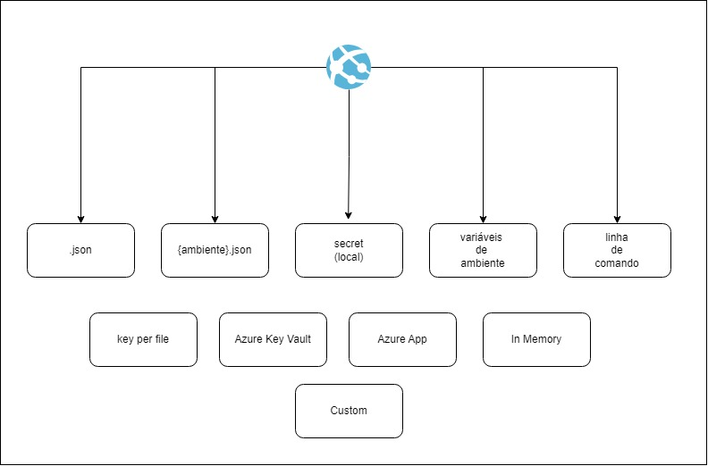

Provedores de configuração do dotnet

Hierarquia padrão (do menos relevante para o mais):

- appsettings.json.
- appsettings.{Environment}.json.
- Secret Manager when the app runs in the Development environment.
- Environment variables.
- Command-line arguments.